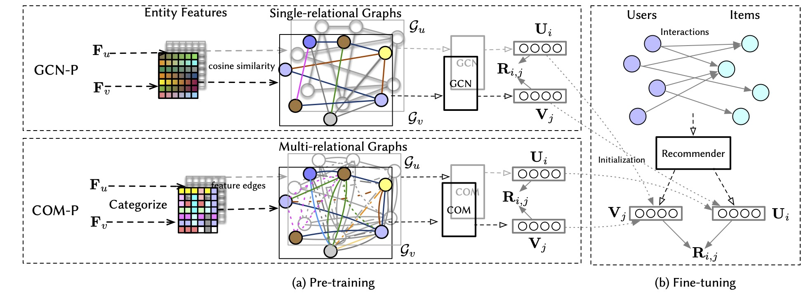

# Graph Neural Pre-training for Enhancing Recommendations using Side Information
> Codes for the anonymous submission: Graph Neural Pre-training for Enhancing Recommendations using Side Information


## Introduction

Leveraging the side information associated with entities (i.e. users and items) to enhance the performance of recommendation systems has been widely recognized as an important modelling dimension. While many existing approaches focus on the integration scheme to incorporate entity side information – by combining the recommendation loss function with an extra side information-aware loss – in this paper, we propose instead a novel pre-training scheme for leveraging the side information. In particular, we first pre-train a representation model using the side information of the entities, and then fine-tune it using an existing general representation-based recommendation model. Specifically, we propose two pre-training models, named GCN-P and COM-P, by considering the entities and their relations constructed from side information as two different types of graphs respectively, to pre-train entity embeddings. For the GCN-P model, two single-relational graphs are constructed from all the users’ and items’ side information respectively, to pre-train entity representations by using the Graph Convolutional Networks. For the COM-P model, two multi-relational graphs are constructed to pre-train the entity representations by using the Composition-based Graph Convolutional Networks. An extensive evaluation of our pre-training models fine-tuned under four general representation-based recommender models, i.e. MF, NCF, NGCF and LightGCN, shows that effectively pre-training embeddings with both the user’s and item’s side information can significantly improve these original models in terms of both effectiveness and stability.



The overall pre-training framework for leveraging the entity side information using graph neural networks. The GCN-P pre-training model constructs two single-relational graphs based on the feature cosine similarities of the entity pairs, and pre-trains the embeddings of entities by using the Graph Convolutional Network (GCN) model.  The COM-P pre-training model constructs two multi-relational graphs based on the categorized feature edges of the entities, and pre-trains the embeddings of entities by using the Compositional-GCN (COM) model.

## Requirements

To install the required packages, please run:

``` python
pip install -r requirements.txt
```
Note that the Compositional-GCN requires some components from [PyTorch Geometric](https://pytorch-geometric.readthedocs.io/en/latest/index.html), where the installation of it can be found from [here](https://pytorch-geometric.readthedocs.io/en/latest/notes/installation.html) 

## Get Started

To run a quick example of LightGCN for using the pretrained weight, you can go to the [examples](https://github.com/pretrain/pretrain/tree/master/examples) folder, and run:

```shell
python train_compgcn_lightgcn.py --dataset foursquare --lr 0.01 --emb_dim 64 --n_base 10 --reg 0.001 --keep_pro 0.9 --pre_train 1
python train_compgcn_lightgcn.py --dataset epinions --lr 0.01 --emb_dim 64 --late_dim 64 --n_base 10 --reg 0.1 --keep_pro 0.9 --pre_train 1

```
where the configurations can be set via [compgcn_lightgcn_default.json](https://github.com/pretrain/pretrain/tree/master/configs/compgcn_lightgcn_default.json).

To pretrain a new weights with our COM-P (or GCN-P), you can go to the [examples](https://github.com/pretrain/pretrain/tree/master/examples) folder, and run:

```shell
python train_compgcn.py
python train_gnn.py
```
with the default configuration saved in [gnn_mf_default.json](https://github.com/pretrain/pretrain/tree/master/configs/gnn_mf_default.json). You can change the default values in the configuration file or create a new one.


To train a baseline model, e.g. Neural Graph Collaborative Filtering, with default configurations, you can run

```shell
python train_ngcf.py
```

If you want to change training configurations, such as the used dataset and the range of hyper-paramters, you can change the default NGCF configuration file or create a new one.

### Pre-training models
* GCN-P:[train_gcn.py](https://github.com/pretrain/pretrain/tree/master/examples/train_gcn.py), which is built based on [GCN](https://arxiv.org/pdf/1609.02907.pdf)
* COM-P:[train_comgcn.py](https://github.com/pretrain/pretrain/tree/master/examples/train_compgcn.py), which is built based on [Compositional-GCN](https://arxiv.org/pdf/1911.03082.pdf)

### Pre-trained weights

Two pretrained weights of the Epinions and Foursquare datasets by our COM-P are provided in this [folder](https://github.com/pretrain/pretrain/tree/master/pre_train_weight).

### Fine-tuning models/baselines
* [MF](https://arxiv.org/pdf/2005.09683.pdf): [train_mf.py](https://github.com/pretrain/pretrain/tree/master/examples/train_mf.py)
* [NGCF](https://arxiv.org/pdf/1905.08108.pdf): [train_ngcf.py](https://github.com/pretrain/pretrain/tree/master/examples/train_ngcf.py)
* [LightGCN](https://arxiv.org/pdf/2002.02126.pdf): [train_lightgcn.py](https://github.com/pretrain/pretrain/tree/master/examples/train_lightgcn.py)
* [NCF](https://arxiv.org/pdf/1708.05031.pdf): [train_ncf.py](https://github.com/pretrain/pretrain/tree/master/examples/train_ncf.py)

To try new datasets, you can create a new dataset script in beta-rec/datasets by referring to how the movielens dataset is dealt with.
To define a new model, you can create a new model script in beta-rec/models by referring to how the NGCF model is defined.


If you have any issue about the reproducibility of this work, please feel free to raise your issues with an anonymous user, we will reply them as soon as possible.
